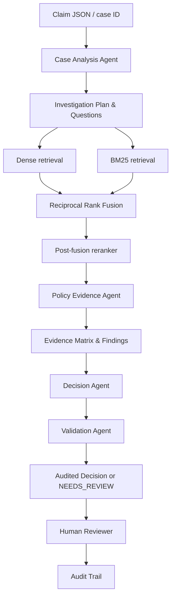

# Aptino Policy-Aware Claim Decision Engine

**🚀 Live Demo:** [https://aptionohealth.streamlit.app/](https://aptionohealth.streamlit.app/)

A professional-grade, evidence-grounded claim investigation platform for synthetic health-insurance claims. This system transforms raw claim data into an auditable investigation, mapping claim facts to policy requirements via a structured evidence matrix, ensuring every decision is grounded in retrieved policy text.

The authoritative source is [`policy/USGIC-CSCIndividualHealthInsurance_2017-2018.pdf`](policy/USGIC-CSCIndividualHealthInsurance_2017-2018.pdf).

## 🎯 Core Principle: Investigation over Prediction
Unlike a chatbot, this platform acts as a decision-support tool for insurance analysts. It follows a strict "fail-closed" logic: if the required evidence is missing or conflicting, the system abstains and returns `NEEDS_REVIEW` rather than guessing.

## 🏗️ Architecture



## 🤖 Multi-Agent Workflow

| Agent | Responsibility | Output |
| :--- | :--- | :--- |
| **Case Analysis** | Normalizes facts, detects data conflicts, identifies missing evidence, and generates targeted investigation questions. | Facts, Conflict List, Missing Evidence, Investigation Plan |
| **Policy Evidence** | Orchestrates hybrid retrieval (Dense + BM25 $\to$ RRF $\to$ Rerank) to fetch high-precision policy clauses. | Ranked, deduplicated policy chunks |
| **Coverage & Exclusion** | Maps facts to policy requirements. Builds the **Evidence Matrix** and identifies specific policy findings (Condition Type, Impact). | Evidence Matrix, Typed Policy Findings |
| **Decision** | Reasons over the Evidence Matrix. Applies safety hierarchy (Missing $\to$ Exclusion $\to$ Limits $\to$ Admissible). | Decision, Confidence Breakdown, Reviewer Explanation |
| **Validation** | Independently verifies that every material conclusion is supported by a valid, retrieved policy citation. | Validation Status (PASS/FAIL), Unsupported Claims |

## 🔍 Key Features

### 1. Evidence Matrix
Instead of a summary, the system produces a matrix for every material dimension:
- **Dimension**: (e.g., Hospital Eligibility)
- **Claim Fact**: What the claimant provided.
- **Policy Requirement**: What the policy demands.
- **Status**: `SUPPORTED`, `PARTIALLY_SUPPORTED`, `MISSING`, `CONFLICTING`, or `NOT_APPLICABLE`.
- **Conclusion**: The derived result for that specific dimension.

### 2. Decision Audit Trail
Every analysis is logged as a sequence of `AuditEvents`. This allows a reviewer to see exactly when a claim was received, what questions were asked, and when a decision was proposed, creating a full provenance chain for the final result.

### 3. Human-in-the-Loop Workflow
The platform supports professional review actions:
- **Approve**: Confirm the automated decision.
- **Send to Review**: Flag for senior management.
- **Request Evidence**: Specifically request missing documents identified by the system.
- **Override**: Manually correct a decision with a documented reason.

## 🚀 Local Setup

### Prerequisites
- Python 3.10+
- API Key for LLM (e.g., OpenAI) configured in `.env`

### Installation
```powershell
# 1. Create and activate environment
python -m venv .venv
.venv\Scripts\Activate.ps1

# 2. Install dependencies
pip install -r requirements.txt

# 3. Configure Environment
Copy-Item .env.example .env
# Edit .env and add your LLM_API_KEY

# 4. Ingest Policy (Mandatory first step)
python scripts/ingest_policy.py

# 5. Start Application
streamlit run frontend/streamlit_app.py
```

## 💻 Interface & API

### Reviewer UI
Launch the investigation workspace:
```powershell
streamlit run frontend/streamlit_app.py
```
**Features**: Case selector, Investigation Workspace (Overview $\to$ Decision $\to$ Matrix $\to$ Findings $\to$ Evidence $\to$ Audit Trail), System Diagnostics, and Evaluation Dashboard.

### API Endpoints
| Endpoint | Method | Description |
| :--- | :--- | :--- |
| `/health` | `GET` | System health check |
| `/analyze` | `POST` | Run full investigation pipeline on a case |
| `/review` | `POST` | Submit a reviewer action (Approve/Override/etc.) |
| `/reviews/{id}` | `GET` | Retrieve review history for a case |

## 📊 Evaluation & Testing

### Running Tests
```powershell
# Run unit tests
python -m pytest -q

# Run full evaluation suite
python evaluation/evaluate.py
```
The evaluator generates a summary in `evaluation/results.json` and a detailed analysis in `evaluation/report.md`.

The evaluator measures:
- **Decision Accuracy**: (For candidate cases with gold labels)
- **Citation Hit Rate**: % of decisions backed by actual policy text.
- **Validation Rate**: % of decisions that passed the citation validator.
- **Latency**: Average time to complete full multi-agent investigation.

## 📚 Documentation
Detailed system specifications are available in the `docs/` directory:
- `llm-architecture.md`: Decoupled provider layer and hallucination defense.
- `security.md`: Prompt injection defense and fail-closed architecture.
- `reviewer-workflow.md`: Operational guide for insurance analysts.

## 🛠️ System Diagnostics
The UI includes a **System Diagnostics** page to verify:
- Policy PDF loading status.
- Local index availability (structural chunks count).
- Retrieval pipeline status (RRF, Reranker, Validation).
- Test suite health.
