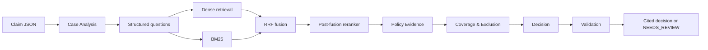

# Architecture

The evidence layer is independent of policy reasoning. The only durable decision inputs are claim facts, specialist findings, and retrieved citations. The validator requires every material finding to cite retrieved chunks; it downgrades failed outputs to `NEEDS_REVIEW`.
